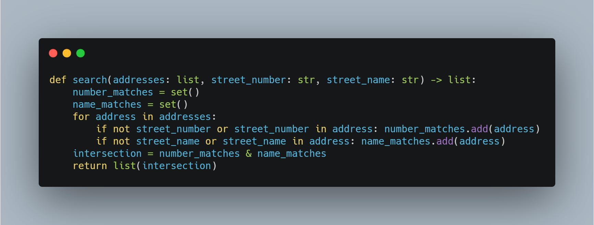

## How to Check If a String Contains a Substring Challenge

The following challenge was described in the article 
[How to Check If a String Contains a Substring](https://therenegadecoder.com/code/how-to-check-if-a-string-contains-a-substring-in-python/#challenge).

### Challenge Description

Write a simple address search engine which filters on two keywords rather than one: street and number.
However, both pieces of information may not be available at the time of search. As a result,
the search engine should match all address that contain the information provided. 

### Expected Behavior

```python
addresses = [
    "123 Elm Street",
    "123 Oak Street",
    "678 Elm Street"
]
search(addresses, "123", None)  # Returns "123 Elm Street" and "123 Oak Street"
search(addresses, "123", "Elm Street")  # Returns "123 Elm Street"
search(addresses, None, "Elm Street")  # Returns "123 Elm Street" and "678 Elm Street"
```

### Example Solution


