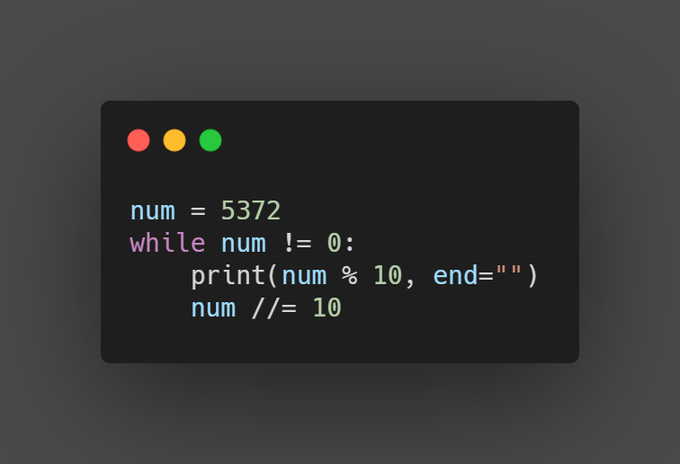

## How to Convert an Integer to a String in Python Challenge

The following challenge was described in the article 
[How to Convert an Integer to a String in Python](https://therenegadecoder.com/code/how-to-convert-an-integer-to-a-string-in-python/#challenge).

### Challenge Description

Write a code snippet that can generate the reverse of an integer as a string.

### Expected Behavior

```python
reverse(1234)  # returns "4321"
```

### Example Solution


