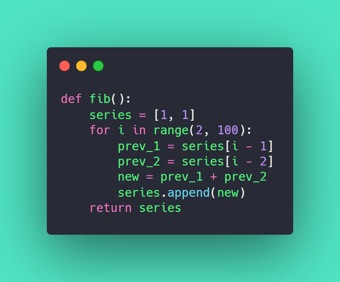

## How to Create a List in Python Challenge

The following challenge was described in the article 
[How to Create a List in Python](https://therenegadecoder.com/code/how-to-create-a-list-in-python/#challenge).

### Challenge Description

Write a program to create a list which contains the first 100 terms of the fibonacci sequence.

### Expected Behavior

```python
fib() # returns [1, 1, 2, ...]
```

### Example Solution


