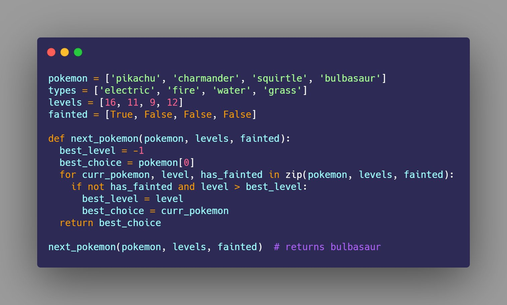

## How to Iterate Over Multiple Lists at the Same Time in Python Challenge

The following challenge was described in the article 
[How to Iterate Over Multiple Lists at the Same Time in Python](https://therenegadecoder.com/code/how-to-iterate-over-multiple-lists-at-the-same-time-in-python/#challenge).

### Challenge Description

Given several lists of pokemon related data, write a program that does some simple analyses. 
For example, can you figure out which Pokemon has the highest level? How about the lowest level?

### Expected Behavior

```python
pokemon = ['pikachu', 'charmander', 'squirtle', 'bulbasaur']
types = ['electric', 'fire', 'water', 'grass']
levels = [16, 11, 9, 12]
fainted = [True, False, False, False]

get_next_best_pokemon(pokemon, levels, fainted)  # returns bulbasaur
```

### Example Solution


