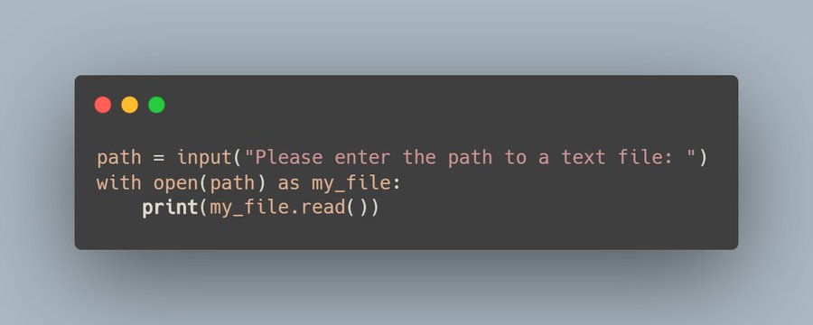

## How to Open a File in Python Challenge

The following challenge was described in the article 
[How to Open a File in Python](https://therenegadecoder.com/code/how-to-open-a-file-in-python/#challenge).

### Challenge Description

Write a program which prompts the user for a file name and outputs the contents to the user (akin to cat).

### Expected Behavior

```shell
>>> Please enter the path to a text file: example.txt
Here are some sample file contents!
```

### Example Solution


