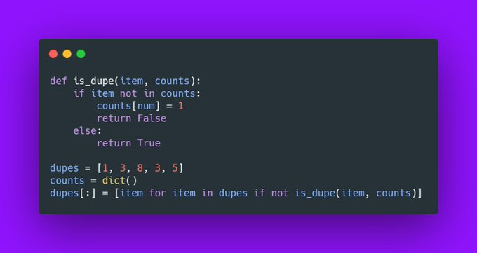

## How to Remove Duplicates From a List in Python Challenge

The following challenge was described in the article 
[How to Remove Duplicates From a List in Python](https://therenegadecoder.com/code/how-to-remove-duplicates-from-a-list-in-python/#challenge).

### Challenge Description

Write a program which removes duplicates from a list in-place. 

### Expected Behavior

```python
dupes = [1, 3, 8, 3, 5]
remove_dupes(dupes) 
print(dupes)  # prints [1, 3, 8, 5]
```

### Example Solution


