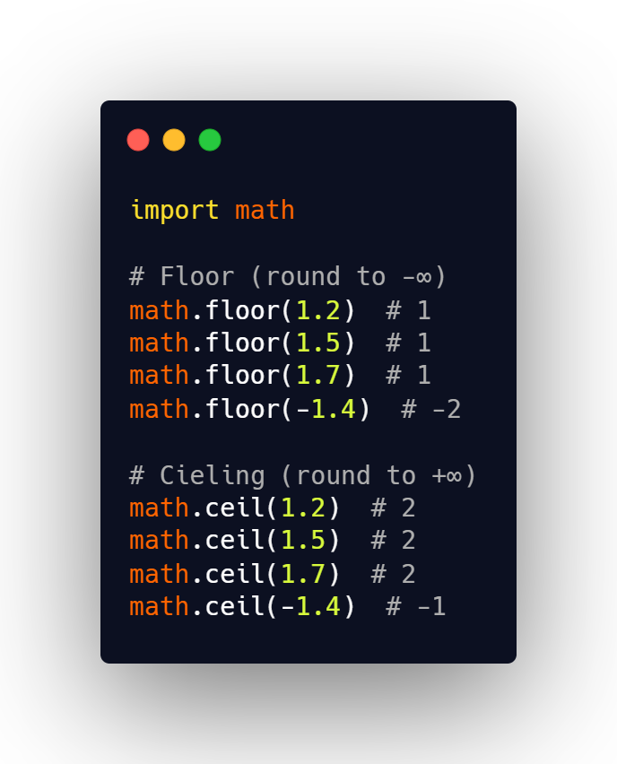

## How to Round a Number in Python Challenge

The following challenge was described in the article 
[How to Round a Number in Python](https://therenegadecoder.com/code/how-to-round-a-number-in-python/#challenge).

### Challenge Description

Write a program which implements your own rounding algorithm. The algorithm suggested in
the article is the bankers algorithm

### Expected Behavior

```python
round(1.5)  # rounds to either 1 or 2 depending on algorithm
```

### Example Solution


